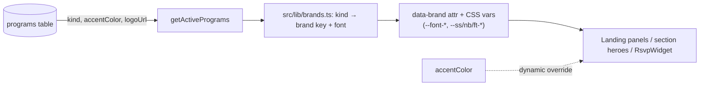
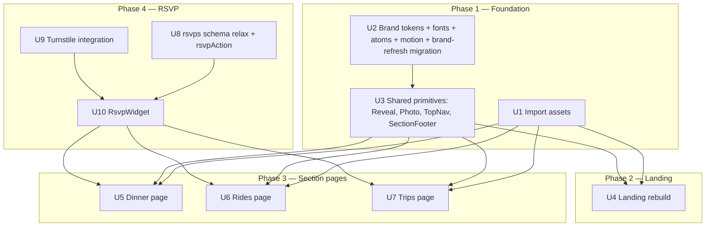

# feat: Sidewalk Story design redesign — phases 1–4

## Summary

Port the imported Claude Design prototype ("South Philly Community" — three sub-brands:
**Sidewalk Story** / dinners, **Nomad Bike Philly** / rides, **Field Trip Philly** / trips) into the
live Next.js 15 app, covering **phases 1–4** of the gap analysis: the three-brand **design system**,
the **landing** rebuild, the **section pages** (dinner / rides / trips) redesign, and the **RSVP
widget** (anonymous quick-yes + optional-email, Turnstile-protected). Community features — photo
albums, discussion boards, trip comments — are **out of scope** here (phases 5–8, planned separately).

The design is the source of truth for required features (see `docs/design-gap-analysis.md`). The
existing backend (D1/Drizzle, server actions, programs layer) is reused; the only schema change in
this plan relaxes `rsvps` to allow anonymous RSVPs.

---

## Problem Frame

The live app is an organizer-broadcast site with a generic single-accent visual system and
placeholder branding ("Our Community"). The approved design is a richer, three-brand community site.
Phases 1–4 deliver the **visible redesign plus working RSVPs** with modest backend risk, deferring the
anonymous-write/moderation complexity to later phases.

Key constraints carried from the origin (see `origin: docs/design-gap-analysis.md` §6, decisions resolved):

- **Reuse the `programs` table** to drive the three brands; per-brand **typography and palette** are a
  code-level map keyed by `programs.kind` (`dinner` → SS, `ride` → NB, `trip` → FT).
- **RSVP** becomes anonymous **quick-yes 👍** _or_ **name + party size with optional email**; relax the
  `rsvps` schema (email nullable, drop the unique-email index) with **Cloudflare Turnstile** bot
  protection on the public write.
- **Newsletter** stays as a footer signup (reuse `SubscribeForm`).
- **Import binary assets** (logos, `dinner-bg.mp4` landscape + mobile, photos) from the design project
  via the design MCP into `public/`.

---

## Requirements

Traced to `docs/design-gap-analysis.md` (§1 required features, §7 phases 1–4). R-IDs are plan-local.

- **R1** — Three-brand design system: 4 fonts (Alfa Slab One, Archivo, Bricolage Grotesque, Karla),
  three color palettes, base atoms (`.btn`/`.field`/`.card`/`.chip`), photo-tile treatment, and motion
  (reveal, drift, float, marquee, pop) with `prefers-reduced-motion` support.
- **R2** — Brand identity is keyed by `programs.kind`; program rows carry the design's real names,
  taglines, accent colors, and logos (replacing placeholders).
- **R3** — Landing: centered header + three full-bleed brand panels driven by active programs; dinner
  panel is video-forward with drifting photo tiles; optional photo marquee; brand-aware nav + footer.
- **R4** — Section pages (dinner / rides / trips): brand hero (logo, headline, feature chips), a
  computed "next event" card, and the design's presentational sections ("how it works" strip for
  dinners, route strip for rides, trip cards for trips).
- **R5** — RSVP widget: one-tap anonymous 👍 counter _or_ name + party size (email optional); live
  "N in so far" headcount and a recent-names line.
- **R6** — Public RSVP writes are bot-protected via Cloudflare Turnstile.
- **R7** — Newsletter signup remains reachable (footer).

**Non-goals (this plan):** photo albums, discussion boards, per-trip "Trip talk" comments, trip
status/poll reconciliation, admin moderation UI. See Scope Boundaries.

---

## Key Technical Decisions

- **KTD1 — Brand tokens keyed by `kind`, not just `accentColor`.** The design needs a richer palette
  per brand (bg, deep, plus accents like steel/coffee/moss/ember) than the single
  `programs.accentColor`. Model brand palettes + font assignments as CSS custom properties scoped by a
  `data-brand="ss|nb|ft"` attribute, with a `src/lib/brands.ts` map from `kind` → brand token keys +
  display font. `programs.accentColor` remains the dynamic primary (admin-editable) and overrides the
  static accent. Mirrors the prototype's `BRANDS` object in `shared.jsx`. _(see origin §6.4)_
- **KTD2 — Fonts via `next/font/google`.** Load Alfa Slab One, Archivo, Bricolage Grotesque, Karla in
  `src/app/layout.tsx` and expose as CSS variables (`--font-ss/nb/ft/body`). Avoids the prototype's
  render-blocking `<link>` and the CDN CSP concerns; self-hosted by Next.
- **KTD3 — Tailwind + CSS custom properties coexist.** Keep Tailwind for layout utilities; add the
  design's token system and component classes (`.btn/.field/.card/.chip/.ph/.rv/...`) plus keyframes to
  `src/app/globals.css`. Do not rip out Tailwind. Port the prototype's `styles.css` largely verbatim
  into `globals.css`, namespaced to avoid clashing with existing utility usage.
- **KTD4 — Programs drive brands; brand metadata (fonts/palette) is code.** Homepage/section pages read
  active programs and resolve brand tokens by `kind`. A brand-refresh migration updates the three
  seeded program rows to the design's names/taglines/colors/logos (idempotent `UPDATE`s by fixed id,
  following the `0004` pattern).
- **KTD5 — RSVP schema relaxation is additive + idempotent.** New migration: make `rsvps.email`
  nullable and **replace** the `rsvps_unique_idx (kind,refId,email)` unique index (anonymous rows have
  no email) with a non-unique index; app-level dedupe for named RSVPs moves into `rsvpAction`. Anonymous
  quick-yes is stored as an `rsvps` row with null name/email and `partySize = 1` plus a `quick` boolean
  flag, so headcount math is unchanged. (SQLite can't drop a column/constraint in place cleanly, but
  dropping an _index_ and adding a _column_ are both simple `DROP INDEX` / `ALTER TABLE ADD COLUMN` —
  no table rebuild needed.) _(see origin §3)_
- **KTD6 — Turnstile via the `turnstile-spin` skill.** Provision the widget + managed siteverify with
  the project's `turnstile-spin` skill during execution; server-side verification lives in
  `src/lib/turnstile.ts` and is called at the top of `rsvpAction`. Secrets: `TURNSTILE_SECRET_KEY`;
  public site key via `NEXT_PUBLIC_TURNSTILE_SITE_KEY`. Fail-open is **not** used — a failed/absent
  token rejects the write. _(see origin §6.1)_
- **KTD7 — No test runner is added in this plan.** The repo has no vitest/jest harness or `test`
  script. Verification runs via `npm run typecheck`, `npm run build`, and browser QA (the `/qa` and
  `/verify` skills). Test-harness setup is deferred (Scope Boundaries). Test scenarios below are written
  as **behaviors to verify** (browser/manual), not as automated-test file paths.

---

## High-Level Technical Design

**Brand resolution flow (data → tokens → render):**



**Dependency / build order (phases → units):**



**Parallelization note (for parallel-agent execution):** U1, U2, U8, U9 have no cross-dependencies and
can start immediately. U3 depends on U2. U4/U5/U6/U7 depend on U1+U3. U10 depends on U8+U9 and then
replaces the RSVP form inside U5/U6/U7 — so **U10 must land before or coordinate with U5–U7** on the
page files, or U5–U7 leave a placeholder RSVP slot that U10 fills. To avoid worktree conflicts, treat
{U5,U6,U7} + U10 as one coordinated stream (RSVP + pages), and {U1,U2,U3,U4} as another.

---

## Output Structure

New/changed files (repo-relative; per-unit `Files:` are authoritative):

```
public/
  brands/sidewalk-story.png        # imported
  brands/nomadic-bike.jpg          # imported
  media/dinner-bg.mp4              # imported (landscape — fills known follow-up)
  media/dinner-bg-mobile.mp4       # imported
  photos/{dinner-couch,dinner-group,dinner-selfie,ride-coffee,
          ride-fallen-tree,ride-staging,ride-uprooted}.jpg   # imported
src/
  lib/brands.ts                    # new — kind → brand tokens + font
  lib/turnstile.ts                 # new — server-side siteverify
  components/Reveal.tsx            # new — IntersectionObserver reveal
  components/Photo.tsx             # new — gradient/photo tile
  components/BrandNav.tsx          # new — brand-aware top nav (or fold into layout)
  components/SectionFooter.tsx     # new — footer + newsletter signup
  components/RsvpWidget.tsx        # new — quick-yes + name/party, Turnstile
  components/TurnstileWidget.tsx   # new — client widget wrapper
  app/globals.css                  # modified — tokens, atoms, motion (port styles.css)
  app/layout.tsx                   # modified — fonts, brand nav/footer
  app/page.tsx                     # modified — landing rebuild
  app/dinner/page.tsx              # modified — redesign
  app/rides/page.tsx               # modified — redesign
  app/trips/page.tsx               # modified — redesign
  app/actions.ts                   # modified — rsvpAction (relaxed + Turnstile)
migrations/
  0005_brand_refresh.sql           # new — update program names/colors/logos
  0006_rsvp_relax.sql              # new — email nullable, drop unique idx, add quick flag
```

---

## Implementation Units

Grouped into the four phases. U-IDs are stable.

### U1. Import design assets into `public/`

- **Goal:** Bring the design project's binary assets into the repo so brand/landing/section work can
  reference real files.
- **Requirements:** R2, R3, R4.
- **Dependencies:** none.
- **Files (create):** `public/brands/sidewalk-story.png`, `public/brands/nomadic-bike.jpg`,
  `public/media/dinner-bg.mp4`, `public/media/dinner-bg-mobile.mp4`,
  `public/photos/dinner-couch.jpg`, `public/photos/dinner-group.jpg`,
  `public/photos/dinner-selfie.jpg`, `public/photos/ride-coffee.jpg`,
  `public/photos/ride-fallen-tree.jpg`, `public/photos/ride-staging.jpg`,
  `public/photos/ride-uprooted.jpg`.
- **Approach:** Read each asset from the design project (project id
  `c15f176a-a531-4ee5-a6f0-6d5af91a851c`) with the design MCP `get_file` (base64) and write to disk.
  Source→dest map: `assets/sidewalk-story.png`→`public/brands/`, `assets/nomadic-bike.jpg`→`public/brands/`,
  `assets/dinner-bg.mp4` + `assets/dinner-bg-mobile.mp4`→`public/media/`, `assets/photos/*`→`public/photos/`.
  The landscape `dinner-bg.mp4` also resolves the existing "desktop dinner video reuses mobile clip"
  follow-up — update `DinnerBackground.tsx` desktop source in U5.
- **Patterns to follow:** existing `public/media/` and `public/brands/` layout.
- **Test scenarios:** `Test expectation: none — binary asset import.` Verify: files exist, non-zero
  size, videos play in a browser, images render.
- **Verification:** all listed files present; `npm run build` still succeeds.

### U2. Brand design-system foundation (tokens, fonts, atoms, motion) + brand-refresh migration

- **Goal:** Establish the three-brand token system, fonts, base component classes, motion CSS, the
  `kind`→brand map, and update program rows to the design's real branding.
- **Requirements:** R1, R2.
- **Dependencies:** none (U1 assets only needed for logo URLs on program rows — use the `public/brands`
  paths).
- **Files:** `src/app/globals.css` (modify), `src/app/layout.tsx` (modify — fonts),
  `src/lib/brands.ts` (create), `tailwind.config.ts` (modify if needed),
  `migrations/0005_brand_refresh.sql` (create).
- **Approach:**
  - Port the prototype `styles.css` token block + atoms (`.btn/.field/.card/.chip/.ph/.topnav/...`) +
    keyframes (`drift`, `floaty`, `marq`, `pop`, `.rv` reveal) into `globals.css`. Keep Tailwind.
  - Define brand palettes as CSS vars scoped under `[data-brand="ss|nb|ft"]` plus `:root` globals
    (paper/ink/muted). Values from origin §4 / prototype `:root`.
  - Load the 4 fonts via `next/font/google` in `layout.tsx`, exposing `--font-ss/nb/ft/body` (KTD2).
  - `src/lib/brands.ts`: export a map `kind → { brandKey: 'ss'|'nb'|'ft', displayFontVar, tagline
default, emoji fallback }` and a helper to resolve a program → brand tokens (mirrors `BRANDS` in
    `shared.jsx`).
  - `0005_brand_refresh.sql`: idempotent `UPDATE programs SET name/tagline/accent_color/logo_url` for
    ids 1/2/3 → Nomad Bike Philly (navy `#1F3A63`, `/brands/nomadic-bike.jpg`), Sidewalk Story
    (red `#A8332A`, `/brands/sidewalk-story.png`), Field Trip Philly (green `#2E5339`, no logo → ⛺).
    Follow the `migrations/0004_programs.sql` fixed-id seed pattern.
- **Patterns to follow:** `migrations/0004_programs.sql` (idempotent UPDATE by id); existing
  `globals.css` Tailwind layer usage; `programs.ts` for the program shape.
- **Test scenarios:** `Test expectation: none — styling + data migration.` Verify (browser/DB):
  fonts load; a `data-brand` container shows the right palette; after `npm run db:migrate:local` the
  three program rows show design names/colors/logos; homepage sections reflect new names.
- **Verification:** `npm run typecheck` + `npm run build` pass; migration applies cleanly in order;
  program rows updated.

### U3. Shared primitives: `Reveal`, `Photo`, brand-aware nav + footer

- **Goal:** Port the reusable presentational primitives the landing and section pages depend on.
- **Requirements:** R1, R3, R7.
- **Dependencies:** U2.
- **Files:** `src/components/Reveal.tsx` (create), `src/components/Photo.tsx` (create),
  `src/components/BrandNav.tsx` (create), `src/components/SectionFooter.tsx` (create),
  `src/app/layout.tsx` (modify — mount nav/footer).
- **Approach:**
  - `Reveal` — client component using `IntersectionObserver` to add `.in` (port `shared.jsx` `Reveal`;
    respect `prefers-reduced-motion` via the CSS already gated in U2).
  - `Photo` — gradient-placeholder + grain tile with optional `src` image and caption overlay (port
    `Photo` + `PH_GRADS`). Placeholder gradients are prototype-only stand-ins; real photos (U1)
    override.
  - `BrandNav` — brand-aware sticky top nav (logo swaps per active brand, links Home/Dinners/Rides/
    Trips, active state). Replaces the current programs-derived nav in `layout.tsx`; keep the
    fail-safe fallback when the programs query errors (mirror current `safePrograms()`).
  - `SectionFooter` — the design footer, **including the newsletter `SubscribeForm`** (R7).
- **Patterns to follow:** existing `layout.tsx` nav + `safePrograms()`; `SubscribeForm.tsx`;
  `"use client"` + `useActionState` component pattern.
- **Test scenarios:**
  - Reveal: element gains `.in` when scrolled into view; with reduced-motion, content is visible
    immediately (no hidden state).
  - Photo: renders `` when `src` present; renders gradient + caption when absent.
  - Nav: active link matches current route; falls back to static links if programs query throws.
  - Footer: newsletter form submits via existing `subscribeAction`.
- **Verification:** typecheck + build pass; nav/footer render on every page; reduced-motion QA.

### U4. Landing rebuild

- **Goal:** Replace the card-section homepage with the design's header + three full-bleed brand panels
  - dinner video hero + optional marquee + footer, driven by active programs.
- **Requirements:** R3.
- **Dependencies:** U1, U3.
- **Files:** `src/app/page.tsx` (modify), plus small panel subcomponents as needed
  (`src/components/LandingPanel.tsx`, `src/components/DinnerPanel.tsx` — create).
- **Approach:** Port `landing.jsx`: centered `header` (Bricolage title "One neighborhood / three ways
  to show up"), then a `LandingPanel` per active program resolved to brand tokens by `kind`; the
  `dinner` kind renders `DinnerPanel` (video-forward, `split-band` default layout) using
  `public/media/dinner-bg.mp4`; non-dinner panels show drifting photo tiles (`Photo` + `DRIFT_SPOTS`).
  Keep it server-rendered where possible; the drift/reveal animation is CSS. Panel CTAs link to
  `programHref(kind)` (`/dinner|/rides|/trips?program=<slug>`). Drop the current standalone newsletter
  section (now in footer, U3). Exclude the prototype `tweaks-panel` and copy-variant switcher — pick
  the "warm" copy as the shipped default.
- **Patterns to follow:** current `page.tsx` `getActivePrograms()` + `itemsForProgram` data reads;
  `programHref` logic in `layout.tsx`.
- **Test scenarios:**
  - Renders one panel per active program, in `sortOrder`; dinner panel shows the video.
  - Panel accent/logo/font match the program's brand (`kind`).
  - CTA hrefs resolve to the right section with `?program=` slug.
  - Reduced-motion: no drift/marquee animation; content static and legible.
- **Verification:** typecheck + build; visual QA vs design at mobile + desktop widths.

### U5. Dinner page redesign (Sidewalk Story)

- **Goal:** Rebuild `dinner/page.tsx` to the design: video backdrop, brand hero (logo, headline,
  chips), computed next-Saturday "next dinner" card, and the RSVP slot.
- **Requirements:** R4, R5 (RSVP slot filled by U10).
- **Dependencies:** U1, U3; RSVP slot coordinates with U10.
- **Files:** `src/app/dinner/page.tsx` (modify), `src/components/DinnerBackground.tsx` (modify —
  desktop source now `public/media/dinner-bg.mp4`).
- **Approach:** Port `dinners.jsx` hero + "how it works" 3-card strip + next-dinner card. Keep the
  existing D1 read for the next published dinner + headcount; render the design's SS-branded hero and
  chips. Replace `RsvpForm` usage with the new `RsvpWidget` (U10) — until U10 lands, leave a clearly
  marked slot. Fix desktop video source (resolves the known follow-up).
- **Patterns to follow:** current `dinner/page.tsx` dinner+headcount query; `DinnerBackground.tsx`
  viewport-select + reduced-motion.
- **Test scenarios:**
  - Shows next published dinner; headcount reflects RSVP rows; "seats left" when capacity set.
  - "No dinner posted" empty state preserved.
  - Desktop uses landscape video, mobile uses portrait; reduced-motion shows poster.
- **Verification:** typecheck + build; visual QA; empty-state QA.

### U6. Rides page redesign (Nomad Bike Philly)

- **Goal:** Rebuild `rides/page.tsx` to the design: NB-branded hero (logo, headline, chips), computed
  next-Sunday "next ride" card, and the route strip.
- **Requirements:** R4, R5 (RSVP slot).
- **Dependencies:** U1, U3; RSVP slot coordinates with U10.
- **Files:** `src/app/rides/page.tsx` (modify); `src/components/RideCard.tsx` (modify for brand
  styling if the list is retained).
- **Approach:** Port `bikes.jsx` hero + route strip (4 stops) + next-ride card. Keep the existing
  published-rides query + per-ride headcounts; apply NB brand tokens (Archivo, navy/steel/coffee).
  Program filter (`?program=`) preserved. RSVP slot → `RsvpWidget` (U10).
- **Patterns to follow:** current `rides/page.tsx` list + headcount; `RideCard.tsx`.
- **Test scenarios:**
  - Renders published upcoming rides; per-ride headcount correct; `?program=` filter works.
  - Route strip renders 4 stops with the coffee stop highlighted.
- **Verification:** typecheck + build; visual QA.

### U7. Trips page redesign (Field Trip Philly)

- **Goal:** Rebuild `trips/page.tsx` to the design: FT-branded hero + trip cards (status chip,
  "N going", expandable RSVP slot). Keep the existing trip signup/poll behavior (comments + poll
  reconciliation are phase 7, out of scope).
- **Requirements:** R4, R5 (RSVP slot).
- **Dependencies:** U1, U3; RSVP slot coordinates with U10.
- **Files:** `src/app/trips/page.tsx` (modify), `src/components/TripCard.tsx` (modify).
- **Approach:** Port `trips.jsx` hero + `TripCard` visual (status chip open/planning derived from
  existing trip fields — `finalDate`/`pollOpen`/`status`; do **not** add the design's comment thread
  here). Expandable panel keeps the existing `TripSignup` (interest + poll) for now, restyled; the
  design's `RsvpWidget` is used where a simple RSVP fits. Keep the "Got a trip idea?" prompt as static
  copy (board is out of scope). Preserve the existing trip list query.
- **Patterns to follow:** current `trips/page.tsx`, `TripCard.tsx`, `TripSignup.tsx`.
- **Test scenarios:**
  - Renders trips with a status chip; "N going" reflects interest/RSVP totals.
  - Expand reveals signup; existing poll/interest still submits via `tripSignupAction`.
- **Verification:** typecheck + build; visual QA; existing trip signup still works.

### U8. Relax `rsvps` schema + update `rsvpAction`

- **Goal:** Allow anonymous RSVPs (quick-yes and name-without-email) at the data + action layer.
- **Requirements:** R5.
- **Dependencies:** none.
- **Files:** `migrations/0006_rsvp_relax.sql` (create), `src/db/schema.ts` (modify — `rsvps`),
  `src/app/actions.ts` (modify — `rsvpAction`, `FormState`).
- **Approach:**
  - Migration: `DROP INDEX rsvps_unique_idx;` then `CREATE INDEX` (non-unique) on `(kind, refId,
email)`; `ALTER TABLE rsvps ADD COLUMN quick INTEGER NOT NULL DEFAULT 0;`. Email column already
    permits null values at the SQLite level; update the Drizzle column to `.notNull()`-free (nullable)
    and add `quick` (boolean).
  - `rsvpAction`: accept (a) quick-yes — no name/email, insert `{name:null, email:null, partySize:1,
quick:true}`; (b) named RSVP — name required, **email optional**, app-level dedupe by
    `(kind,refId,email)` only when email present (upsert-ish: skip duplicate). Return the design's
    friendly `{ok, message}`. Preserve best-effort confirmation email only when an email was given.
    Call `verifyTurnstile()` (U9) first.
- **Patterns to follow:** `migrations/0003_trip_notify.sql` / `0004` (idempotent ALTER);
  existing `rsvpAction` in `src/app/actions.ts`; schema conventions in `docs/solutions/coding-conventions.md`.
- **Test scenarios:**
  - Quick-yes with no name/email inserts a row and increments headcount by 1.
  - Named RSVP with email dedupes on repeat submit (same email/event → no duplicate).
  - Named RSVP **without** email succeeds (no unique-constraint error).
  - Confirmation email attempted only when email present; failure is non-fatal (mutation still ok).
  - `Covers R5.`
- **Verification:** typecheck + build; `db:migrate:local` applies 0006 after 0005; manual insert paths
  behave as above.

### U9. Cloudflare Turnstile integration

- **Goal:** Bot-protect the public RSVP write.
- **Requirements:** R6.
- **Dependencies:** none (consumed by U10; verify called from U8's `rsvpAction`).
- **Files:** `src/lib/turnstile.ts` (create), `src/components/TurnstileWidget.tsx` (create),
  `cloudflare-env.d.ts` (modify — add `TURNSTILE_SECRET_KEY`), `wrangler.jsonc` (modify — public site
  key var), `.env.example` (modify).
- **Approach:** Use the project `turnstile-spin` skill to provision the widget + managed siteverify.
  `src/lib/turnstile.ts` exports `verifyTurnstile(token, ip?)` calling siteverify with
  `TURNSTILE_SECRET_KEY`; returns boolean (reject on failure — no fail-open, KTD6).
  `TurnstileWidget` is a client wrapper that renders the widget and yields a token to the RSVP form.
  Site key via `NEXT_PUBLIC_TURNSTILE_SITE_KEY`. Secret via `npx wrangler secret put
TURNSTILE_SECRET_KEY` (document, don't commit).
- **Patterns to follow:** `turnstile-spin` skill; existing env access via `src/lib/env.ts`; secret
  handling per README.
- **Test scenarios:**
  - `verifyTurnstile` returns false on missing/invalid token; true on a valid test token.
  - `rsvpAction` rejects when verification fails (write does not occur).
  - `Covers R6.`
- **Verification:** typecheck + build; Turnstile widget renders; a tampered/absent token is rejected
  end-to-end (browser QA).

### U10. `RsvpWidget` component

- **Goal:** Ship the design's RSVP widget (quick-yes 👍 + name/party form, live headcount + recent
  names, Turnstile-gated) and wire it into the three section pages.
- **Requirements:** R5, R6.
- **Dependencies:** U8, U9; edits page files also touched by U5/U6/U7 (coordinate — see
  parallelization note).
- **Files:** `src/components/RsvpWidget.tsx` (create), `src/app/dinner/page.tsx`,
  `src/app/rides/page.tsx`, `src/app/trips/page.tsx` (modify — swap RSVP slot); may retire
  `src/components/RsvpForm.tsx` once unused.
- **Approach:** Port `RsvpWidget` from `shared.jsx`: a quick-yes button (posts a quick RSVP), plus a
  name + party-size form with **optional** email; show "N in so far" and recent names from the passed
  RSVP data. Embed `TurnstileWidget` and include the token in the submit. Bind to the relaxed
  `rsvpAction` via `useActionState`. Replace the RSVP slot left by U5/U6/U7. Accept `eventId`
  equivalent as `{kind, refId}` + initial headcount/recent-names props (server-provided).
- **Patterns to follow:** `RsvpForm.tsx` (`useActionState`), the prototype `RsvpWidget`, brand tokens
  from U2.
- **Test scenarios:**
  - Quick-yes path: one tap → headcount +1, no name required.
  - Named path: name + party submits; email field optional; success message shows.
  - Widget blocks submit until Turnstile token present.
  - Recent-names line reflects latest RSVPs.
  - `Covers R5.` `Covers R6.`
- **Verification:** typecheck + build; browser QA on all three pages (both RSVP paths + Turnstile).

---

## Scope Boundaries

**In scope (phases 1–4):** three-brand design system, landing rebuild, section-page redesign, RSVP
widget with anonymous quick-yes + optional email + Turnstile, newsletter footer signup, asset import,
brand-refresh + rsvps-relax migrations.

### Deferred for later (origin phases 5–8, separate plans)

- Photo albums (`albums`/`album_photos` tables, R2 upload, admin moderation).
- Community board (`board_posts`/`comments`/`votes`) + per-trip "Trip talk" comments.
- Trip status/poll reconciliation (keep-poll-and-add-comments decision, origin §6.3).
- Admin moderation UI (hide/delete community content).

### Deferred to Follow-Up Work (plan-local)

- **Test harness**: add vitest (or Workers-compatible test runner) so `rsvpAction`/`verifyTurnstile`
  get real automated coverage. Not added here (KTD7) — verification is typecheck + build + browser QA.
- Copy-variant ("warm"/"direct") switcher and the design tweaks panel — shipped as "warm" default.
- Replacing prototype gradient-placeholder photos with a fuller real-photo set beyond U1's imports.

### Outside scope

- Any anonymous _content_ writes other than RSVP (boards/photos) — those carry the moderation surface
  and are gated to later phases per the origin decision.

---

## Risks & Dependencies

- **Worktree collisions on page files.** U5/U6/U7 and U10 both edit `dinner/rides/trips` pages. For
  parallel execution, run {U5,U6,U7,U10} as one coordinated stream (or have U5–U7 leave a labeled RSVP
  slot that U10 fills), and {U1,U2,U3,U4} as another. U8/U9 are independent and safe to parallelize.
- **Turnstile provisioning needs Cloudflare API access.** Same account already deployed; the
  `turnstile-spin` skill needs a token/keys. If provisioning can't run, ship the widget behind a
  feature flag and land schema/action first (U8) — but do not enable public RSVP without verification
  (no fail-open).
- **CSS regression risk** porting `styles.css` into a Tailwind app — namespace the design's component
  classes and QA existing admin pages (which keep the current utility styling) for breakage.
- **`global_fetch_strictly_public` flag** (already set) — Turnstile siteverify + font/asset fetches must
  be to public hosts; self-hosted `next/font` avoids a CDN dependency.
- **SQLite constraint changes** — dropping the unique index + adding a column are simple; no table
  rebuild. Confirm no code still relies on the unique constraint for dedupe (moved into `rsvpAction`).
- **Migration ordering** — `0005` (brand refresh) and `0006` (rsvps relax) must apply after `0001–0004`.

---

## Verification Strategy

No automated test runner in this plan (KTD7). Each unit verifies via:

1. `npm run typecheck` and `npm run build` green.
2. `npm run db:migrate:local` applies `0005` then `0006` cleanly after `0001–0004`.
3. Browser QA (`/qa`, `/verify`) against the design at mobile (≤700px) and desktop widths, including
   reduced-motion; both RSVP paths (quick-yes + named) and Turnstile rejection.
4. Existing flows unbroken: admin pages, trip signup/poll, newsletter subscribe.

---

## Sources & Research

- Origin: `docs/design-gap-analysis.md` (feature inventory, resolved decisions §6, phases §7).
- Codified codebase knowledge: `docs/solutions/{data-model-and-database,app-architecture-and-integrations,programs-layer-architecture,coding-conventions}.md`.
- Design source (read this session): Claude Design project `c15f176a-a531-4ee5-a6f0-6d5af91a851c` —
  `index.html`, `styles.css`, `app.jsx`, `landing.jsx`, `dinners.jsx`, `bikes.jsx`, `trips.jsx`,
  `shared.jsx`, `data.js`.
- Turnstile: project `turnstile-spin` skill (mirrors developers.cloudflare.com/turnstile).
