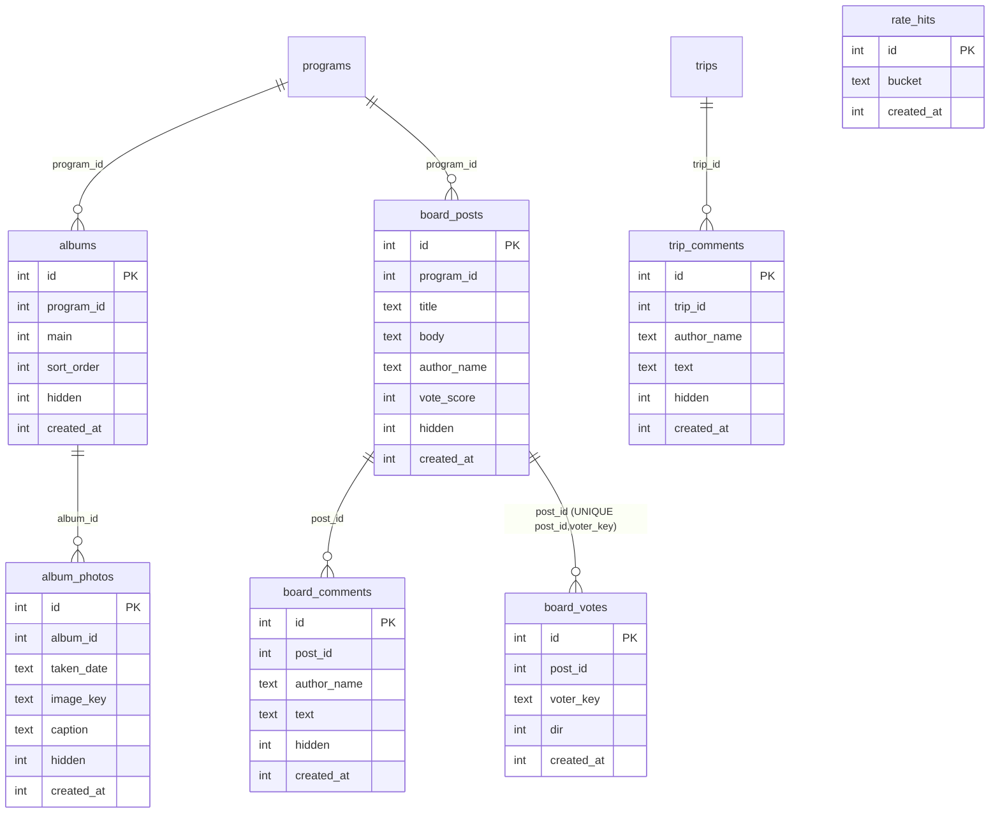
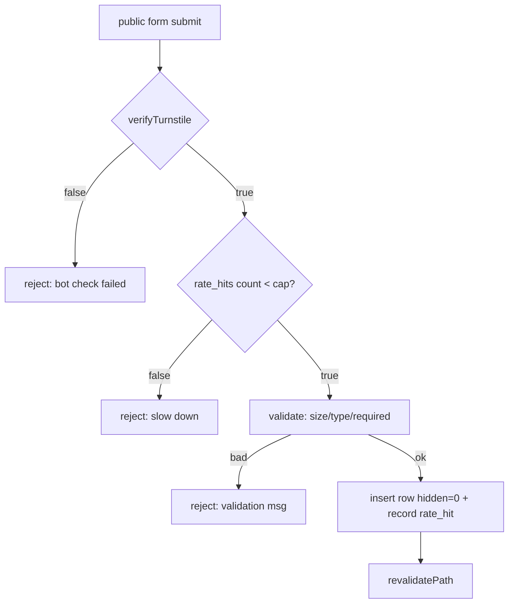
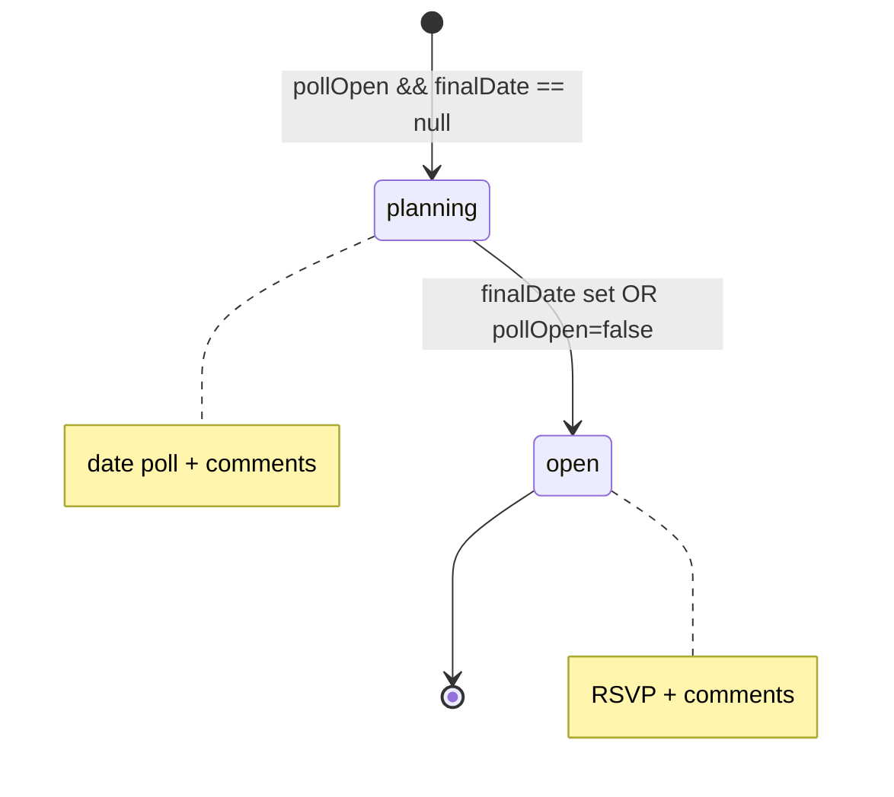

# feat: Sidewalk Story community features — phases 5–8

## Summary

Build the **community-write** half of the design — the features deferred from the shipped phases 1–4
redesign: **photo albums** (anonymous upload), a **community board** (posts/votes/comments), per-trip
**"Trip talk"** comments, **trips reconciliation** (`open`/`planning` + keep the date poll), and an
**admin moderation** surface. This is the part of the design that turns the site from
organizer-broadcast into community-writable (see `origin: docs/design-gap-analysis.md` §0), so it
carries the real anonymous-write + abuse surface — every public write is Turnstile-gated and
soft-moderatable.

Phases 1–4 (design system, landing, section pages, RSVP + Turnstile infra) are **done and deployed**;
this plan builds on that foundation (`src/lib/turnstile.ts`, `src/components/TurnstileWidget.tsx`,
`src/lib/brands.ts`, the `programs`-driven brand system).

---

## Problem Frame

The live site lets only the admin create content and only lets the public RSVP. The design wants a
lightweight neighborhood social layer: anyone can add photos, start a board post, comment, and vote —
no account. That means **new public, unauthenticated write endpoints** with the guardrails an open
surface needs (bot protection, rate limits, upload caps, and reversible moderation). All product
decisions were resolved in the origin §6 and this session; this plan is the **HOW**.

Resolved decisions carried forward (`origin` §6):

- Community writes are **open + admin moderation + Turnstile** on every public write.
- Anonymous uploads: **8 MB image-type cap** (existing convention) + **rate limiting** + admin hide/delete.
- **Vote dedupe via a cookie-based voter key.**
- **Reuse the `programs` table**; brand tokens keyed by `kind` (`src/lib/brands.ts`).
- **Trips: keep the date poll AND add comments** — poll maps to `planning`, `open` shows RSVP + comments.

Confirmed this session:

- **Rate limiting** = Turnstile-as-primary + a lightweight **D1-backed per-IP cap** on uploads/posts.
- **Moderation** = **soft-hide (reversible `hidden` flag) primary, hard-delete available.**

---

## Requirements

Traced to `docs/design-gap-analysis.md` §1–§3 (deferred phases 5–8) and the design prototype
`design_handoff_community_site/design/shared.jsx`. R-IDs are plan-local.

- **R1** — Shared photo albums per program: multiple albums, one "main", **date-grouped** display,
  **no-account photo upload** to R2, inline create-album.
- **R2** — Community board per program: posts (title/body/optional name), **up/down votes** (one per
  voter), threaded **comments**, inline composer.
- **R3** — Per-trip **"Trip talk"** comment thread.
- **R4** — Trips reconciliation: status **`open` | `planning`**, "N going"; `planning` keeps the
  existing date-availability poll, `open` shows RSVP; both show comments.
- **R5** — Every public community write is **Turnstile-gated** and **rate-limited**; uploads enforce
  the 8 MB image-type cap.
- **R6** — **Admin moderation**: hide/unhide (reversible) and hard-delete for photos, posts,
  comments, and trip comments; hidden content is excluded from all public queries.
- **R7** — All new sections honor `prefers-reduced-motion` and the three-brand token system.

**Non-goals:** accounts/identity, board email digests, notifications, new brand/IA work (shipped in
phases 1–4). See Scope Boundaries.

---

## Key Technical Decisions

- **KTD1 — Community content hangs off `programs` via `program_id`.** The prototype keys albums/board
  by a `section` string (`dinners`/`bikes`/`trips`); we instead reference the program row (nullable
  `program_id`, convention-only, no FK — per `docs/solutions/coding-conventions.md`) so the 3 brands
  and any future program work uniformly. Resolve brand tokens by the program's `kind`.
- **KTD2 — Soft-hide via a `hidden` boolean on every community row.** Public queries filter
  `hidden = 0`; admin can hide/unhide (reversible) or hard-delete. Cheaper and safer than delete-only,
  and matches the confirmed moderation model. No moderation _queue_ (content is live-then-moderated,
  per the "open" decision) — just a review/hide surface.
- **KTD3 — Vote dedupe via a cookie-issued voter key.** On first vote, issue a random `voterKey`
  cookie (httpOnly, long-lived); `board_votes` has `UNIQUE(post_id, voter_key)`. Re-voting updates or
  clears the row; `vote_score` is recomputed/adjusted. This is best-effort (clearing cookies lets a
  user re-vote) — acceptable for a neighborhood board, and matches origin §3.
- **KTD4 — Rate limiting is D1-backed, Turnstile-primary.** Turnstile already gates every write
  (phase 4). On top, a `rate_hits` table records `(bucket, created_at)` where `bucket =
"<action>:<ipHash>"` (IP from `CF-Connecting-IP` via `next/headers`, hashed — never stored raw, per
  privacy). A write is rejected if the count in a rolling window exceeds the action's cap. Avoids a new
  KV binding; fits the hand-written-migration + no-FK convention. Caps are per-action constants.
- **KTD5 — Anonymous uploads reuse the existing R2 upload path.** Store under `MEDIA` at
  `community/<program-slug>/<album-id>/<rand>.<ext>`, 8 MB + image-MIME enforced in the action
  (mirrors the admin `uploadLogo`/`imageKey` convention). Served via `R2_PUBLIC_BASE_URL`. The
  prototype's client-side `FileReader→dataURL` is replaced by a real multipart upload to a server
  action.
- **KTD6 — Trip `open`/`planning` is derived, not a new column.** `planning` = `pollOpen && finalDate
IS NULL`; `open` = `finalDate` set OR `pollOpen` false. Keeps the existing poll + trips schema
  intact (no trips migration); admin already controls `pollOpen`/`finalDate`. "N going" reuses the
  existing interest/RSVP counts.
- **KTD7 — No test runner (unchanged).** Verify via `npm run typecheck`, `npm run build`,
  `npm run db:migrate:local`, and browser QA. Test scenarios below are behaviors to verify. Adding a
  test harness stays deferred.

---

## High-Level Technical Design

**New data model (all convention-only relations, no FK; `hidden` on moderatable rows):**

**Public write path (shared by every community action):**

**Trip status derivation (KTD6):**

---

## Implementation Units

Grouped into the four phases. Migrations continue from `0006` → start at `0007`. U-IDs are stable.

### Phase 5 — Photo albums

### U1. Album schema + rate-limit table (migration 0007)

- **Goal:** Persist albums, photos, and the rate-limit ledger.
- **Requirements:** R1, R5, R6.
- **Dependencies:** none.
- **Files:** `migrations/0007_albums.sql` (create), `src/db/schema.ts` (modify — add `albums`,
  `albumPhotos`, `rateHits` + row types).
- **Approach:** Hand-written idempotent SQL (per `docs/solutions/coding-conventions.md`).
  `albums(id, program_id, name, main INTEGER, sort_order, hidden INTEGER DEFAULT 0, created_at)`;
  `album_photos(id, album_id, taken_date TEXT, image_key TEXT, caption, hidden INTEGER DEFAULT 0,
created_at)`; `rate_hits(id, bucket TEXT, created_at)`. Indexes: `albums(program_id)`,
  `album_photos(album_id)`, `rate_hits(bucket, created_at)`. Drizzle: epoch-int `createdAt`,
  `mode:"boolean"` for `main`/`hidden`.
- **Patterns to follow:** `migrations/0002_trips.sql`, `migrations/0004_programs.sql`; schema style in
  `src/db/schema.ts`.
- **Test scenarios:** `Test expectation: none — schema/migration.` Verify: `db:migrate:local` applies
  0007 after 0001–0006; tables + indexes exist; a manual insert of an album + photo succeeds.
- **Verification:** typecheck + build; migration applies cleanly.

### U2. Public upload + album server actions + rate limiter

- **Goal:** Anonymous photo upload to R2 and album creation, gated + rate-limited; query helpers.
- **Requirements:** R1, R5.
- **Dependencies:** U1.
- **Files:** `src/lib/ratelimit.ts` (create — `checkRate(bucketAction)` using `rate_hits` + hashed
  `CF-Connecting-IP`), `src/lib/albums.ts` (create — `getAlbums(programId)`, `getAlbumPhotos`,
  grouping helpers), `src/app/community/actions.ts` (create — `uploadPhotoAction`,
  `createAlbumAction`), test notes inline.
- **Approach:** `uploadPhotoAction`: `verifyTurnstile` → `checkRate("upload")` → validate image MIME +
  ≤8 MB → write to `MEDIA` at `community/<program-slug>/<album-id>/<randomToken>.<ext>` → insert
  `album_photos` (`hidden=0`, `taken_date` = today or provided) → `revalidatePath`. `createAlbumAction`:
  Turnstile + rate → insert `albums`. Read IP via `next/headers`; hash before use/store (KTD4).
  Reuse `slugify`/`randomToken` (`src/lib/utils.ts`) and the 8 MB/MIME convention from admin uploads.
- **Patterns to follow:** admin R2 upload in `src/app/admin/actions.ts` (`uploadLogo`), `rsvpAction`
  Turnstile gating in `src/app/actions.ts`, `src/lib/programs.ts` query style.
- **Test scenarios:**
  - Valid image ≤8 MB with a good Turnstile token uploads and appears in the album.
  - Missing/invalid Turnstile token → rejected, no R2 write, no row. `Covers R5.`
  - Non-image MIME or >8 MB → rejected with a clear message.
  - Exceeding the upload cap within the window → rejected ("slow down"); a later attempt after the
    window succeeds. `Covers R5.`
  - `createAlbumAction` with empty name → rejected; valid name → album appears, selectable.
  - Uploaded photo's public URL (via `R2_PUBLIC_BASE_URL`) resolves.
- **Verification:** typecheck + build; manual upload via a temporary form or the U3 UI.

### U3. AlbumSection UI + wire into section pages

- **Goal:** Port the prototype album UI and mount it on dinner/rides/trips.
- **Requirements:** R1, R7.
- **Dependencies:** U2.
- **Files:** `src/components/AlbumSection.tsx` (create), `src/app/dinner/page.tsx`,
  `src/app/rides/page.tsx`, `src/app/trips/page.tsx` (modify — add the section).
- **Approach:** Port `AlbumSection` from `design_handoff_community_site/design/shared.jsx`: album
  tabs (with counts), date-grouped photo grid using the existing `Photo` + `Reveal` components, an
  upload button (real multipart form → `uploadPhotoAction`, replacing the prototype's `FileReader`
  dataURL), and an inline new-album form → `createAlbumAction`. Include the `TurnstileWidget` for the
  gated submits. Server component fetches albums/photos (hidden filtered) and passes to the client
  section. Brand tokens by program `kind`.
- **Patterns to follow:** `RsvpWidget` (client + `useActionState` + `TurnstileWidget`), `Photo`,
  `Reveal`, the prototype `AlbumSection`.
- **Test scenarios:**
  - Renders albums with counts; switching tabs shows that album's date-grouped photos.
  - Upload flow adds a photo to the active album and re-renders.
  - Empty album shows the "be the first" state.
  - Reduced-motion: photos visible without reveal animation. `Covers R7.`
- **Verification:** typecheck + build; browser QA of upload + album switching.

### Phase 6 — Community board + trip comments

### U4. Board + trip-comment schema (migration 0008)

- **Goal:** Persist board posts, comments, votes, and trip comments.
- **Requirements:** R2, R3, R6.
- **Dependencies:** none (parallelizable with Phase 5).
- **Files:** `migrations/0008_board.sql` (create), `src/db/schema.ts` (modify — add `boardPosts`,
  `boardComments`, `boardVotes`, `tripComments` + row types).
- **Approach:** `board_posts(id, program_id, title, body, author_name, vote_score INTEGER DEFAULT 0,
hidden INTEGER DEFAULT 0, created_at)`; `board_comments(id, post_id, author_name, text, hidden,
created_at)`; `board_votes(id, post_id, voter_key TEXT, dir INTEGER, created_at)` with
  **UNIQUE(post_id, voter_key)**; `trip_comments(id, trip_id, author_name, text, hidden, created_at)`.
  Indexes on the parent FKs (`post_id`, `trip_id`, `program_id`). Idempotent SQL.
- **Patterns to follow:** `migrations/0002_trips.sql` (indexes + UNIQUE dedupe like
  `trip_poll_votes_unique_idx`); schema conventions.
- **Test scenarios:** `Test expectation: none — schema/migration.` Verify: 0008 applies after 0007;
  UNIQUE(post_id, voter_key) rejects a duplicate vote row; inserts for each table succeed.
- **Verification:** typecheck + build; migration applies.

### U5. Board + trip-comment server actions (public, gated)

- **Goal:** Create posts/comments/votes and trip comments, all gated + rate-limited + dedup'd.
- **Requirements:** R2, R3, R5.
- **Dependencies:** U4; rate limiter from U2.
- **Files:** `src/lib/board.ts` (create — query helpers `getPosts(programId)`, `getComments`,
  `getTripComments`), `src/app/community/actions.ts` (modify — add `createPostAction`,
  `addCommentAction`, `voteAction`, `addTripCommentAction`).
- **Approach:** Each action: `verifyTurnstile` → `checkRate` → validate → insert (`hidden=0`) →
  `revalidatePath`. `voteAction`: read/issue the `voterKey` cookie (`next/headers` cookies, httpOnly,
  long expiry); upsert on `UNIQUE(post_id, voter_key)`; adjust `vote_score` for new/changed/cleared
  votes (KTD3). Comments require a post/trip that exists and isn't hidden. `author_name` optional
  (defaults to "Neighbor").
- **Patterns to follow:** `rsvpAction` (Turnstile + `{ok,message}` state), `src/lib/session.ts` cookie
  handling (jose cookie pattern → mirror for the plain `voterKey` cookie), `src/lib/programs.ts`.
- **Test scenarios:**
  - Create post with title → appears at top of that program's board; without title → rejected.
  - Add comment → appears under the post; comment on a hidden/nonexistent post → rejected.
  - First upvote sets score +1 and issues a cookie; re-voting the same direction is a no-op; switching
    to downvote moves score by 2; clearing returns to baseline. `Covers R2.`
  - Second vote from the same cookie on the same post does not create a duplicate row (UNIQUE).
  - Trip comment posts to the right trip; Turnstile-less submit rejected. `Covers R3, R5.`
  - Rate cap exceeded → rejected.
- **Verification:** typecheck + build; manual exercise via U6 UI.

### U6. Board + TripComments UI + wire in

- **Goal:** Port the board and trip-comment UI and mount them.
- **Requirements:** R2, R3, R7.
- **Dependencies:** U5.
- **Files:** `src/components/Board.tsx` (create — Board + Post), `src/components/TripComments.tsx`
  (create), `src/app/dinner/page.tsx`, `src/app/rides/page.tsx`, `src/app/trips/page.tsx` (modify),
  `src/components/TripCard.tsx` (modify — host TripComments in the expanded panel).
- **Approach:** Port `Board`/`Post` and `TripComments` from
  `design_handoff_community_site/design/{shared,trips}.jsx`: post list with vote controls, expandable
  comments, inline composer; all writes via U5 actions + `TurnstileWidget`. Server components fetch
  non-hidden posts/comments and pass down. Brand tokens by `kind`. Vote UI reflects the cookie'd
  voter's current vote.
- **Patterns to follow:** the prototype `Board`/`Post`/`TripComments`; `RsvpWidget` client pattern;
  `TripCard` (already an expandable client component from phase 4).
- **Test scenarios:**
  - Board renders non-hidden posts newest/most-voted first; composer creates a post.
  - Expanding a post shows comments; composer adds one.
  - Vote arrows reflect and update the cookie'd voter's vote.
  - Trip card's expanded panel shows "Trip talk" alongside the existing poll/RSVP.
  - Reduced-motion honored. `Covers R7.`
- **Verification:** typecheck + build; browser QA.

### Phase 7 — Trips reconciliation

### U7. Trip open/planning status + Trip talk integration

- **Goal:** Show `open`/`planning` status and "N going", keep the date poll under `planning`, and
  surface comments — reconciling the design with the existing trip poll.
- **Requirements:** R3, R4.
- **Dependencies:** U6 (TripComments).
- **Files:** `src/components/TripCard.tsx` (modify), `src/app/trips/page.tsx` (modify),
  `src/app/trips/[slug]/page.tsx` (modify).
- **Approach:** Derive status (KTD6): `planning` = `pollOpen && finalDate == null`, else `open`.
  Status chip + "N going" (existing interest/RSVP counts). `planning` shows the existing `TripSignup`
  poll (interest + date votes); `open` shows the RSVP path; both show `TripComments`. No trips
  migration — purely presentational + wiring over existing fields. Keep the existing
  `tripSignupAction`/poll untouched.
- **Patterns to follow:** existing `TripCard`/`TripSignup`, `src/app/trips/page.tsx` query.
- **Test scenarios:**
  - Trip with an open poll and no final date shows "planning" + the poll.
  - Trip with a final date shows "open" + RSVP.
  - Both show Trip talk; "N going" matches interest/RSVP totals. `Covers R4.`
  - Existing poll voting still works (regression).
- **Verification:** typecheck + build; browser QA on `/trips` + a trip detail.

### Phase 8 — Admin moderation + polish

### U8. Admin moderation surface

- **Goal:** Let the admin hide/unhide and hard-delete community content; exclude hidden from public.
- **Requirements:** R6.
- **Dependencies:** U1, U4 (hidden flags + tables); U3, U6 (public queries to filter).
- **Files:** `src/app/admin/moderation/page.tsx` (create), `src/app/admin/actions.ts` (modify — add
  `hideContentAction`/`unhideContentAction`/`deleteContentAction` covering photos, posts, comments,
  trip comments), verify all public query helpers filter `hidden = 0`.
- **Approach:** Admin-guarded page (`requireAdmin()`) listing recent photos/posts/comments with
  hide/unhide + delete controls (each a `void` FormData admin action, per the codebase's admin-action
  pattern). Hide = set `hidden=1` (reversible); delete = remove row (+ R2 object for photos).
  Confirm every public helper (`src/lib/albums.ts`, `src/lib/board.ts`) filters `hidden=0`.
- **Patterns to follow:** `src/app/admin/actions.ts` status-toggle actions (`await requireAdmin()` +
  `revalidatePath`), `src/app/admin/page.tsx` layout.
- **Test scenarios:**
  - Hiding a post removes it from the public board but keeps it in admin (unhide restores it).
  - `Covers R6.`
  - Deleting a photo removes the row and its R2 object.
  - Hidden comments don't render publicly under their post/trip.
  - Non-admin cannot reach the moderation page or actions (redirect to login).
- **Verification:** typecheck + build; browser QA hide→public-refresh→unhide, and delete.

### U9. Polish + cross-page consistency

- **Goal:** Consistent placement, empty states, reduced-motion QA, and copy across the new sections.
- **Requirements:** R7.
- **Dependencies:** U3, U6, U7, U8.
- **Files:** `src/app/dinner/page.tsx`, `src/app/rides/page.tsx`, `src/app/trips/page.tsx` (modify),
  minor CSS in `src/app/globals.css` if needed.
- **Approach:** Ensure Album + Board sections sit consistently below the hero on all three pages with
  brand-correct headings; verify empty states; QA `prefers-reduced-motion`; tighten copy. Replace the
  prototype "Got a trip idea?" static prompt behavior if the board now covers it.
- **Patterns to follow:** phase 1–4 section-page structure.
- **Test scenarios:** `Test expectation: none — presentational polish.` Verify: consistent section
  order across pages; reduced-motion QA; empty states render.
- **Verification:** typecheck + build; browser QA across all three pages.

---

## Scope Boundaries

**In scope (phases 5–8):** albums + anonymous upload, board + votes + comments, trip comments, trip
`open`/`planning` reconciliation (keeping the poll), rate limiting, admin moderation (hide/delete),
and polish.

### Deferred to Follow-Up Work (plan-local)

- **Test harness** (vitest/Workers runner) for the public actions + rate limiter + vote dedupe.
- **Cron cleanup** of old `rate_hits` rows (table grows; a periodic prune via the existing cron worker).
- Auto-post community highlights to Instagram (the IG lib is generic).
- Richer moderation (bulk actions, audit log, per-IP ban).

### Outside scope

- Accounts, identity, or auth for community writes (stays anonymous by design).
- Board email digests / notifications.
- Any new brand, landing, or IA work (shipped in phases 1–4).

---

## Risks & Dependencies

- **Abuse surface (primary risk).** Open anonymous writes invite spam/abuse. Mitigation: Turnstile on
  every write (already live), D1 rate caps (KTD4), soft-hide moderation (KTD2), and 8 MB/image-MIME
  upload limits. Residual: determined abuse; the admin hide/delete surface is the backstop. Requires a
  **real Turnstile key** in production (still outstanding from phase 4 — writes are blocked until set).
- **Anonymous R2 uploads** put user-supplied images on a public bucket. Mitigation: MIME/size caps,
  hashed-IP rate cap, admin delete (removes the R2 object). No EXIF stripping in v1 — note as a
  follow-up risk.
- **Vote dedupe is cookie-based** (KTD3) — clearing cookies allows re-voting. Accepted for a
  neighborhood board; not a security control.
- **`rate_hits` growth** — unbounded without pruning (deferred cleanup). Low volume expected; revisit
  if it grows.
- **IP handling/privacy** — hash `CF-Connecting-IP`, never store raw (KTD4).
- **Migration ordering** — `0007` then `0008`, after `0001`–`0006`.
- **Sequencing** — Phase 5 (U1–U3) and Phase 6 schema/actions (U4–U5) are independent and
  parallelizable; U3/U6/U7 all edit the three section pages, so coordinate those page edits (one
  stream) to avoid conflicts. U8 depends on the tables + public queries existing.

---

## Verification Strategy

No automated test runner (KTD7). Per unit:

1. `npm run typecheck` + `npm run build` green.
2. `npm run db:migrate:local` applies `0007`, `0008` after `0001`–`0006`.
3. Browser QA: upload a photo, create/vote/comment on a board post, add a trip comment, exercise the
   `open`/`planning` trip states, and moderate (hide→verify public→unhide, delete). Confirm
   Turnstile-less/over-cap writes are rejected.
4. Regression: existing RSVP, trip poll, newsletter, and admin flows still work.

---

## Sources & Research

- Origin: `docs/design-gap-analysis.md` (§0 write model, §2 feature diff, §3 data-model gaps, §6 resolved decisions).
- Phase 1–4 plan (foundation this builds on): `docs/plans/2026-07-14-001-feat-design-redesign-p1-4-plan.md`.
- Design prototype source (in-repo): `design_handoff_community_site/design/{shared,dinners,bikes,trips}.jsx`.
- Conventions + data model: `docs/solutions/coding-conventions.md`, `docs/solutions/data-model-and-database.md`, `docs/solutions/app-architecture-and-integrations.md`.
- Existing infra reused: `src/lib/turnstile.ts`, `src/components/TurnstileWidget.tsx`, `src/lib/brands.ts`, R2 upload in `src/app/admin/actions.ts`.
