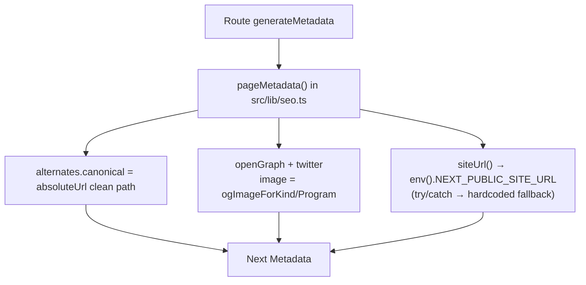
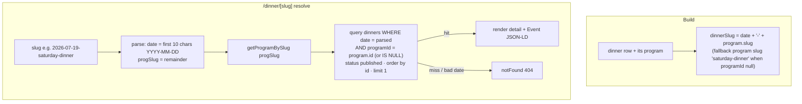

# feat: SEO Optimization Sweep

## Summary

Give every public page a full SEO surface: per-page `generateMetadata` (unique title +
description + canonical), OpenGraph + Twitter cards backed by per-kind static images with a
site-wide fallback, `Event` JSON-LD on event detail pages and `Organization`/`WebSite` JSON-LD
on the home page, plus `sitemap.ts` and `robots.ts`. Adds a new `/dinner/[slug]` permalink for
each Saturday dinner (composite `date`-`program-slug`, no schema change) and introduces a
canonical-origin env var (`NEXT_PUBLIC_SITE_URL`) wired to `metadataBase`.

This is one metadata/plumbing sweep, not a behavioral change — no data model migration, no
change to RSVP/poll/cron logic, and the existing `force-dynamic` posture is preserved.

---

## Problem Frame

Sidewalk Story is server-rendered and crawlable but its SEO surface is nearly bare: a single
root `metadata` block (title/description/icons) inherited by every page, **no** `metadataBase`,
no per-page metadata, no OG/Twitter cards, no JSON-LD, no sitemap, no robots, no canonical URLs.
Program pages are filtered via `?program=<slug>` query params that need canonicalization, and
dinners have no per-dinner permalink (unlike rides/trips).

Two equally-weighted outcomes (see origin: `docs/brainstorms/2026-07-14-seo-optimization-requirements.md`):

1. **Search discovery** — a stranger in Philly searching "free community dinner" or "Sunday bike
   ride Philly" lands on the right page.
2. **Shareability** — a link dropped into Instagram/iMessage/WhatsApp renders a rich preview card
   instead of a bare URL.

---

## Resolved Open Questions

The origin doc left three questions "for planning." All three are resolvable from the codebase;
resolutions below, with rationale.

### Q1 — OG image source: `programs.ogImageUrl` field vs. `kind`→asset map → **`kind`→static asset map (in code)**

**Decision:** Resolve OG images through a code-level `kind`→static-asset map plus a site-wide
default, in `src/lib/seo.ts`. **Do not** add a `programs.ogImageUrl` column or admin upload UI.

**Rationale:**

- The origin settled on "one branded image per program **kind** (dinner/rides/trips), reused
  across all events of that kind, with a site-wide default fallback" — that is per-_kind_, not
  per-row, so a `kind` map delivers the exact settled requirement.
- Mirrors the existing `src/lib/brands.ts` `BRAND_BY_KIND` pattern (brand identity is already
  keyed by `kind`, not by program row), so this is consistent, not novel.
- Zero migration, zero admin work, zero runtime image generation — lowest carrying cost for a
  volunteer-run site (explicitly the origin's stated preference).
- **Extension boundary:** the resolver is a single function `ogImageForProgram(program)`. If
  true per-program custom OG art is ever wanted, only that function changes (add an optional
  column, prefer it when set, fall back to the `kind` map). Recorded in Deferred Follow-Up.

### Q2 — `?program=` canonical target: self-canonical vs. collapse → **collapse to the un-parameterized path**

**Decision:** The canonical URL for `/dinner`, `/rides`, `/trips` is always the **clean,
un-parameterized path**, regardless of any `?program=` value. The program-aware `<title>` and
description still render (for shareability), but the canonical consolidates indexing to the base
URL.

**Rationale:**

- Today exactly one active program exists per kind (seeded ids 1/2/3 in migration `0004`), so
  every `?program=X` variant is content-identical to its base path → they are duplicate content
  and must share one canonical.
- Matches the origin's own phrasing ("canonical should point to the **clean program URL**").
- Prevents unknown/garbage `?program=foo` params from minting infinite indexable variants.
- **Revisit trigger** (recorded in Deferred Follow-Up): if the site ever runs 2+ active programs
  of the same kind — genuinely different filtered content — switch to self-canonical per valid
  program slug.

### Q3 — Dinner short-program-slug form → **reuse `programs.slug` verbatim**

**Decision:** The dinner permalink is `<dinner.date>-<program.slug>`, e.g.
`/dinner/2026-07-19-saturday-dinner`, using the dinner program's own `programs.slug`
(`saturday-dinner`) with no separate "shortened" form.

**Rationale:**

- The origin's own example (`/dinner/2026-07-19-saturday-dinner`) already uses the program slug
  verbatim.
- `programs.slug` is already unique, human-readable, and stable; a parallel shortened form would
  add a mapping with no benefit and a new failure mode.
- Reverse lookup is deterministic (see U5 approach).

---

## Key Technical Decisions

### KTD1 — Canonical origin: `https://sidewalkstoryphilly.com` via `NEXT_PUBLIC_SITE_URL`

The origin doc flagged "confirm the domain before shipping." **It is already confirmed in code:**
`wrangler.jsonc` `routes` bind the custom domain `sidewalkstoryphilly.com` + `www.` with
auto-TLS. So the canonical origin is settled — no user decision needed. Add
`NEXT_PUBLIC_SITE_URL = "https://sidewalkstoryphilly.com"` as a wrangler `var`, type it in
`cloudflare-env.d.ts`, and read it through the existing `env()` accessor.

**Important pattern note:** in this codebase, `NEXT_PUBLIC_*` values are **wrangler vars read at
request time via `env()`** (they are typed in `CloudflareEnv`), _not_ Next's build-time
`process.env` inlining. So a `siteUrl()` helper reads `env().NEXT_PUBLIC_SITE_URL` at request
time. Because `sitemap.ts`/`robots.ts` and `generateMetadata` may be evaluated in contexts where
`getCloudflareContext()` is unavailable (e.g. build-time static analysis), `siteUrl()` **must**
`try/catch` and fall back to a hardcoded `https://sidewalkstoryphilly.com` constant so nothing
crashes at build. This is the single most important robustness detail in the plan.

### KTD2 — One SEO helper module (`src/lib/seo.ts`) is the single source of truth

All metadata construction flows through helpers in a new `src/lib/seo.ts`: `siteUrl()`,
`absoluteUrl(path)`, `ogImageForKind(kind)` / `ogImageForProgram(program)`, and a `pageMetadata({
title, description, path, kind?, program? })` factory that returns a Next `Metadata` object with
`alternates.canonical`, `openGraph`, and `twitter` filled in. Every route's `generateMetadata`
composes from this factory rather than hand-rolling tags, so titles/cards stay consistent and the
canonical rules live in exactly one place.

### KTD3 — JSON-LD via a tiny server component (`src/components/JsonLd.tsx`)

Structured data is emitted with a small server component that renders
`<script type="application/ld+json">` from a passed object (JSON-stringified). Builder functions
(`eventJsonLd`, `organizationJsonLd`, `websiteJsonLd`) live in `src/lib/seo.ts`. Builders **omit
optional keys when the source field is null** (e.g. a dinner with no `location`) so the emitted
JSON-LD is always valid — the origin's graceful-degradation requirement.

### KTD4 — Event JSON-LD field mapping

`Event` schema is populated from existing fields, per kind:

- `name` ← title, `startDate` ← `date` (+ `startTime` when present, as local ISO), `description`
  ← description (fallback to a kind-generic sentence), `location` ← `location`/`meetLocation`/
  `destination` as a `Place` (omit when null), `organizer` ← `Organization` (site name + URL),
  `eventStatus` ← `https://schema.org/EventCancelled` when `status === "cancelled"` else
  `EventScheduled`, `eventAttendanceMode` ← `OfflineEventAttendanceMode`.
- Dinners are free → `isAccessibleForFree: true` and a zero-price `offers`. Rides/trips →
  `isAccessibleForFree: true` (no ticketing today); omit `offers`.
- `image` ← absolute OG image URL for the kind.

### KTD5 — Preserve `force-dynamic`; no static generation change

All data pages keep `export const dynamic = "force-dynamic"` (D1 is per-request). Fully
server-rendered HTML is fine for crawlers. `sitemap.ts` also sets `force-dynamic` because it
queries D1. No ISR/caching work — explicitly out of scope.

---

## High-Level Technical Design

### Metadata + canonical resolution (all routes)

`?program=` never enters the canonical — index routes always canonicalize to the bare path (Q2).

### Dinner permalink: build + reverse lookup (U5)

---

## Scope Boundaries

### In scope

- `NEXT_PUBLIC_SITE_URL` env var + `metadataBase` wiring.
- `src/lib/seo.ts` (helpers + JSON-LD builders) and `src/components/JsonLd.tsx`.
- `generateMetadata` on: home, `/dinner`, `/rides`, `/trips`, `/rides/[slug]`, `/trips/[slug]`,
  and new `/dinner/[slug]`.
- OG + Twitter cards on every page; per-kind static image + site-wide default.
- `Event` JSON-LD on the three detail routes; `Organization` + `WebSite` on home.
- `sitemap.ts` (static routes + all published dinners/rides/trips) and `robots.ts`.
- New `/dinner/[slug]` route + a link to it from `/dinner`.

### Out of scope (origin non-goals)

- **Auto-generated per-event OG images** (title/date/headcount baked in). Declined in favor of
  per-kind static images.
- **A `slug` column on `dinners`** — the composite date+program slug avoids it.
- Analytics / Search Console setup, backlinks, content marketing, blog.
- Newsletter double opt-in and other unrelated `CLAUDE.md` follow-ups.
- ISR/caching/static-generation changes.

### Deferred to follow-up work

- Optional `programs.ogImageUrl` column + admin upload, for true per-program OG art (extend
  `ogImageForProgram` only). Not needed for the settled per-kind requirement.
- Self-canonical `?program=` per valid program slug — revisit if 2+ active programs of one kind
  ever exist.
- Purpose-built 1200×630 OG art at `public/og/{default,dinner,ride,trip}.jpg` to replace the
  interim existing-photo mapping (see U1 note). Dropping the files + updating the map is the whole
  change.
- A UNIQUE index on `dinners(date, programId)` to hard-guarantee permalink uniqueness (today the
  reverse lookup is deterministic via `order by id · limit 1`).

---

## Implementation Units

### U1. Canonical origin env var + SEO helper library

**Goal:** Establish the canonical origin and centralize all metadata/JSON-LD construction so
every later unit composes from one place.

**Requirements:** Dependencies (canonical origin), In-scope items 1–2. Advances all success
criteria (foundation).

**Dependencies:** none.

**Files:**

- `wrangler.jsonc` (add `NEXT_PUBLIC_SITE_URL` to `vars`)
- `cloudflare-env.d.ts` (add `NEXT_PUBLIC_SITE_URL: string`)
- `src/lib/seo.ts` (new)
- `src/lib/seo.test.ts` (new — if a test runner is present; see Test note)

**Approach:**

- Add `"NEXT_PUBLIC_SITE_URL": "https://sidewalkstoryphilly.com"` to `wrangler.jsonc` `vars` and
  the matching type in `cloudflare-env.d.ts`. Note in a comment that local dev may override via
  `.dev.vars` (no `.dev.vars` file exists today; not required — the hardcoded fallback covers
  local).
- `src/lib/seo.ts` exports:
  - `SITE_URL_FALLBACK = "https://sidewalkstoryphilly.com"` (const).
  - `siteUrl(): string` — `try { return env().NEXT_PUBLIC_SITE_URL?.replace(/\/$/, "") ?? FALLBACK } catch { return FALLBACK }`. **Must not throw.**
  - `absoluteUrl(path: string): string` — join `siteUrl()` + leading-slashed path.
  - `OG_IMAGE_BY_KIND: Record<Program["kind"], string>` and `OG_IMAGE_DEFAULT` — interim map to
    existing landscape photos: dinner → `/photos/dinner-group.jpg`, ride → `/photos/ride-coffee.jpg`,
    trip → `/photos/dinner-group.jpg` (no trip photo exists yet), default → `/photos/dinner-group.jpg`.
    Add a `// TODO: replace with purpose-built 1200x630 art at /og/*.jpg` comment.
  - `ogImageForKind(kind)` and `ogImageForProgram(program | null)` (falls back to kind, then default).
  - `pageMetadata({ title, description, path, kind?, imagePath? }): Metadata` — builds `title`,
    `description`, `alternates: { canonical: absoluteUrl(path) }`, `openGraph` (type website,
    `url`, `siteName`, `title`, `description`, `images: [{ url: absolute OG, width:1200,
height:630 }]`), `twitter: { card: "summary_large_image", ... }`.
  - JSON-LD builders returning plain objects: `organizationJsonLd()`, `websiteJsonLd()`,
    `eventJsonLd(input)` — each omits keys whose source is null (KTD3/KTD4).
- Mirror `src/lib/brands.ts` `BRAND_BY_KIND` shape for the OG map (consistency).

**Patterns to follow:** `src/lib/brands.ts` (kind-keyed record), `src/lib/env.ts` (`env()`
accessor), `src/lib/utils.ts` (small pure helpers).

**Test scenarios:**

- `siteUrl()` returns the env value with a trailing slash stripped when env is present.
- `siteUrl()` returns the hardcoded fallback and does **not** throw when `env()` throws
  (simulate by calling outside a request context / mocking `env` to throw).
- `absoluteUrl("/dinner")` → `https://.../dinner`; handles a path with and without a leading slash.
- `ogImageForProgram(null)` → default; `ogImageForProgram({kind:"ride",...})` → ride image.
- `eventJsonLd` **omits** `location` when location input is null, and includes it as a `Place`
  when present; sets `eventStatus` to `EventCancelled` for a cancelled event; sets
  `isAccessibleForFree: true` for dinners.
- `pageMetadata` sets `alternates.canonical` to the clean path and `twitter.card` to
  `summary_large_image`.

**Test note:** repo has `zod`/`drizzle-kit` etc. but confirm a test runner exists
(`package.json` scripts) before adding `src/lib/seo.test.ts`. If no runner is configured, make
these helpers pure and rely on `npm run typecheck` + `npm run build`; record the untested-by-unit
status here rather than inventing a test harness. `siteUrl`, `absoluteUrl`, and the JSON-LD
builders are pure functions and the highest-value targets if a runner is added.

**Verification:** `npm run typecheck` passes; helpers importable; `siteUrl()` never throws.

---

### U2. Root layout — `metadataBase`, title template, default OG/Twitter

**Goal:** Give the whole site a base URL for relative metadata resolution and a sensible default
social card, so pages that don't override still produce valid cards.

**Requirements:** Per-page metadata (default layer), social cards (default), metadataBase dependency.

**Dependencies:** U1.

**Files:**

- `src/app/layout.tsx`

**Approach:**

- Convert the static `metadata` export to an async `generateMetadata()` (needed because
  `metadataBase` derives from `siteUrl()` at request time). Keep all existing fields (icons,
  manifest, appleWebApp, applicationName, formatDetection) unchanged.
- Add `metadataBase: new URL(siteUrl())`.
- Add `title: { default: "Sidewalk Story", template: "%s · Sidewalk Story" }` so child pages set
  only their leaf title.
- Add default `openGraph` + `twitter` (site name, default title/description, default OG image via
  `ogImageForKind`/`OG_IMAGE_DEFAULT`) so any page without its own card still renders one.
- Leave `viewport` export untouched.

**Patterns to follow:** existing `metadata`/`viewport` exports in `src/app/layout.tsx`.

**Test scenarios:** `Test expectation: none -- metadata-only config change.` Verify via
view-source in U-level verification (below) and the final build.

**Verification:** `npm run build` passes; view-source of `/` shows `<meta property="og:*">`,
`twitter:card`, and an absolute `og:url`.

---

### U3. Home page metadata + Organization/WebSite JSON-LD

**Goal:** Org-level title/description for the home page and site-level structured data.

**Requirements:** Home metadata; `Organization` + `WebSite` JSON-LD on home.

**Dependencies:** U1, U2.

**Files:**

- `src/app/page.tsx`
- `src/components/JsonLd.tsx` (new)

**Approach:**

- Add `JsonLd.tsx`: a server component taking `data: object`, rendering
  `<script type="application/ld+json" dangerouslySetInnerHTML={{ __html: JSON.stringify(data) }} />`.
- In `page.tsx` add `generateMetadata()` via `pageMetadata({ title: "Saturday dinners, Sunday
rides & community trips in Philadelphia", description: <org positioning from origin>, path: "/"
})`. Because the home title should read as the org name (not templated), set the leaf title to
  a full phrase or use `title.absolute` to bypass the template as appropriate.
- Render `<JsonLd data={organizationJsonLd()} />` and `<JsonLd data={websiteJsonLd()} />` inside
  the page (top of the returned tree is fine).
- `organizationJsonLd`: `@type Organization`, name "Sidewalk Story", url `siteUrl()`, logo
  absolute brand image (`/brands/sidewalk-story.png`), `areaServed`/`description` optional.
- `websiteJsonLd`: `@type WebSite`, name, url.

**Patterns to follow:** existing home `page.tsx` structure; keep panels untouched.

**Test scenarios:**

- Covers success criterion "valid Organization/WebSite JSON-LD on home": rendered `<script
type="application/ld+json">` parses as JSON and contains `@type: "Organization"` and a separate
  `WebSite` object.
- Home `<title>` and description differ from the layout default.

**Verification:** view-source of `/` shows two `ld+json` blocks that pass Google's Rich Results /
Schema validator; unique title + description.

---

### U4. Index page metadata + canonical (dinner, rides, trips)

**Goal:** Program-aware titles/descriptions on the three list pages, with the canonical always
pointing at the clean un-parameterized path (Q2).

**Requirements:** Per-page metadata for index pages (program-aware); canonical handling of `?program=`.

**Dependencies:** U1, U2.

**Files:**

- `src/app/dinner/page.tsx`
- `src/app/rides/page.tsx`
- `src/app/trips/page.tsx`

**Approach:**

- Add `generateMetadata({ searchParams })` to each. Resolve the program the same way the page
  body does (`programSlug ? getProgramBySlug(slug) : null`), and build a program-aware title
  (e.g. `${program?.name ?? brandForKind(kind).name}` + a kind phrase) and description.
- **Canonical is always the clean path** (`/dinner`, `/rides`, `/trips`) — pass `path` without
  the query string to `pageMetadata`, regardless of `?program=` (Q2). The program-aware
  title/description still render for shareability.
- OG image = `ogImageForProgram(program)` (falls back to kind).
- Note: `searchParams` is a `Promise` in Next 15 — `await` it, matching the existing page
  signatures.

**Patterns to follow:** existing `searchParams: Promise<{ program?: string }>` handling and
`getProgramBySlug` usage already in these three files; `brandForKind`/`brandForProgram`.

**Test scenarios:**

- `/rides` and `/rides?program=nomadic-bike-philly` both emit `<link rel="canonical">` pointing
  at the **clean** `/rides` (Q2).
- With a valid `?program=`, the `<title>` reflects the program name; without it, the kind-default
  title.
- An unknown `?program=zzz` does not throw and still canonicalizes to the clean path.
- Each of the three index pages has a distinct title/description from each other and from home.

**Verification:** view-source of each index page (with and without `?program=`) shows the correct
canonical and program-aware title; build passes.

---

### U5. New `/dinner/[slug]` permalink route + Event JSON-LD + link from `/dinner`

**Goal:** Every dinner gets a stable, indexable, shareable permalink matching rides/trips, with
event metadata and `Event` structured data — no schema change.

**Requirements:** New `/dinner/[slug]` route; per-event dinner metadata; `Event` JSON-LD for
dinners; slug format `<date>-<program-slug>` (Q3).

**Dependencies:** U1, U2.

**Files:**

- `src/lib/dinner-permalink.ts` (new — `dinnerSlug()` + `findDinnerBySlug()`)
- `src/app/dinner/[slug]/page.tsx` (new)
- `src/app/dinner/page.tsx` (add a link from the next-dinner card to its permalink)
- `src/lib/dinner-permalink.test.ts` (new — if a runner exists; see U1 test note)

**Approach:**

- `dinnerSlug(dinner, program)`: `${dinner.date}-${program?.slug ?? "saturday-dinner"}`. The
  fallback keeps the slug resolvable for program-less dinners (backfill in `0004` assigned
  program ids, but `createDinnerAction` can fall back to null if no dinner-kind program exists).
- `findDinnerBySlug(slug)`: parse `date = slug.slice(0,10)` (validate `YYYY-MM-DD`), `progSlug =
slug.slice(11)`. Look up the program by `progSlug` (`getProgramBySlug`). Query dinners where
  `date` matches AND (`programId = program.id` when found, else `programId IS NULL`), filter
  `status !== "draft"` (mirror rides/trips detail behavior), order by `id`, `limit 1`. Return
  `{ dinner, program } | null`. Deterministic even in the rare same-date+same-program collision.
- `src/app/dinner/[slug]/page.tsx`: `export const dynamic = "force-dynamic"`; `params:
Promise<{ slug }>`; `notFound()` when `findDinnerBySlug` misses or the date is malformed.
  Render a detail view (reuse the visual language of the existing dinner page / rides detail —
  title, formatted date, location, startTime, headcount via `rsvps` where `(kind:"dinner",
refId)`, and an `RsvpForm kind="dinner"`). Add `generateMetadata` via `pageMetadata` with an
  event-specific title (`${dinner.title} — ${formatDate(dinner.date)}`) and description, canonical
  = `absoluteUrl('/dinner/' + slug)`. Emit `<JsonLd data={eventJsonLd(...)} />`.
- In `src/app/dinner/page.tsx`, wrap/append a link on the next-dinner card to
  `/dinner/${dinnerSlug(dinner, program)}` ("Details & share" / permalink). The `/dinner` index
  keeps showing the next dinner (unchanged behavior).

**Patterns to follow:** `src/app/rides/[slug]/page.tsx` and `src/app/trips/[slug]/page.tsx`
(detail page shape, `notFound()`, headcount reduce, `ProgramBadge`, `RsvpForm`); `src/lib/utils.ts`
`formatDate`; `getProgramBySlug`/`getProgramById`.

**Test scenarios:**

- `dinnerSlug` builds `2026-07-19-saturday-dinner` from a dinner dated `2026-07-19` + program
  slug `saturday-dinner`; falls back to `saturday-dinner` when program is null.
- `findDinnerBySlug("2026-07-19-saturday-dinner")` returns the matching published dinner; returns
  null for a non-existent date; returns null for a malformed slug (`not-a-date-foo`).
- A draft dinner is treated as `notFound` (mirrors rides/trips).
- Reverse lookup handles a program slug that itself contains hyphens (e.g. `saturday-dinner`) —
  only the first 10 chars are the date, remainder (after the separator) is the program slug.
- Covers success criterion "each dinner reachable at a stable permalink": rendering the route
  produces a page (not 404) for a seeded dinner and emits valid `Event` JSON-LD with `startDate`,
  `name`, `isAccessibleForFree: true`, and no `location` key when the dinner has no location.

**Verification:** navigating to a real dinner permalink renders the detail page; view-source
shows event-specific title, canonical, OG card, and a valid `Event` JSON-LD block; the `/dinner`
index links to it.

---

### U6. Ride + trip detail metadata + Event JSON-LD

**Goal:** Event-specific metadata and `Event` structured data on the existing ride/trip detail
routes.

**Requirements:** Per-event metadata for `/rides/[slug]` and `/trips/[slug]`; `Event` JSON-LD on
both.

**Dependencies:** U1, U2.

**Files:**

- `src/app/rides/[slug]/page.tsx`
- `src/app/trips/[slug]/page.tsx`

**Approach:**

- Add `generateMetadata({ params })` to each: `await params`, load the ride/trip by slug
  (`getDb().select()...where(eq(slug))`), `notFound`-safe (return a minimal default `Metadata`
  when the row is missing so the page's own `notFound()` still governs the 404). Build
  event-specific title (`${ride.title} — ${formatDate(ride.date)}`; for trips use `finalDate ||
tentativeWindow`) + description. Canonical = `absoluteUrl` of the detail path. OG image:
  prefer the event's own R2 cover (`imageKey` → `R2_PUBLIC_BASE_URL/...`) when present, else
  `ogImageForProgram(program)`; use an absolute URL.
- Render `<JsonLd data={eventJsonLd(...)} />` in each page body (near the header). Rides map
  `startDate` from `date`+`startTime`, `location` from `meetLocation`, `eventStatus` from
  `status`. Trips map `startDate` from `finalDate` when set (omit `startDate` gracefully when the
  date is undecided — an `Event` without a firm date should still be valid; if omitting
  `startDate` risks invalidity, fall back to `tentativeWindow` rendered only in description and
  skip emitting `Event` when there is no date — decide at implementation, documented here as the
  one graceful-degradation call).
- Reuse the existing per-request DB read already in each page rather than double-fetching where
  Next dedupes; a second lightweight fetch in `generateMetadata` is acceptable given
  `force-dynamic`.

**Patterns to follow:** existing `src/app/rides/[slug]/page.tsx` / `src/app/trips/[slug]/page.tsx`
(DB read by slug, `env().R2_PUBLIC_BASE_URL` image URL construction, `getProgramById`).

**Test scenarios:**

- A ride detail page emits an `Event` JSON-LD with `name`, `startDate`, `location` (from
  meetLocation), and `eventStatus: EventCancelled` when the ride is cancelled.
- A trip with a `finalDate` emits `startDate`; a trip with only a `tentativeWindow` degrades
  gracefully (no invalid JSON-LD — either no `startDate` if schema-valid, or `Event` omitted per
  the documented call).
- Ride/trip detail `<title>` and canonical are event-specific and absolute.
- OG image uses the event's R2 cover when `imageKey` is set, else the kind fallback.

**Verification:** view-source of a ride and a trip detail page shows event-specific title,
canonical, OG card, and a valid `Event` JSON-LD block passing the Rich Results Test.

---

### U7. Crawler plumbing — `sitemap.ts` + `robots.ts`

**Goal:** Emit a dynamic sitemap of all public routes + published events and a robots policy that
allows crawling, blocks `/admin` and `/api`, and references the sitemap.

**Requirements:** `sitemap.ts` listing static routes + all published events with `lastModified`;
`robots.ts` allowing crawl, disallowing `/admin` + `/api`, referencing the sitemap.

**Dependencies:** U1.

**Files:**

- `src/app/sitemap.ts` (new)
- `src/app/robots.ts` (new)

**Approach:**

- `sitemap.ts`: `export const dynamic = "force-dynamic"` (queries D1). Default export returns
  `MetadataRoute.Sitemap`. Include static routes: `/`, `/dinner`, `/rides`, `/trips`. Then query
  published `dinners`, `rides`, `trips` (`status = "published"`) and append:
  - rides → `absoluteUrl('/rides/' + slug)`
  - trips → `absoluteUrl('/trips/' + slug)`
  - dinners → `absoluteUrl('/dinner/' + dinnerSlug(dinner, program))` — join to the program slug
    (reuse `dinnerSlug`; batch-load programs via `getActivePrograms()`/`getProgramById` to avoid
    N+1, or map programId→slug once).
  - `lastModified` ← `createdAt` (or `date`) per row; use `new Date()` for static routes.
  - Wrap the D1 queries in try/catch → fall back to just the static routes if the DB read fails
    (mirrors `safePrograms()` resilience in `layout.tsx`), so the sitemap never 500s.
- `robots.ts`: default export returns `MetadataRoute.Robots` — `rules: { userAgent: "*", allow:
"/", disallow: ["/admin", "/api"] }`, `sitemap: absoluteUrl('/sitemap.xml')`, `host: siteUrl()`.

**Patterns to follow:** `safePrograms()` try/catch resilience (`src/app/layout.tsx`); `dinnerSlug`
from U5; `env()`/`siteUrl()`.

**Test scenarios:**

- Covers success criterion "sitemap lists all published events": the generated sitemap array
  includes an entry for each published dinner (with composite slug), ride, and trip, plus the
  four static routes, all absolute URLs.
- Draft/cancelled events are excluded (only `status = "published"`).
- `robots` output disallows `/admin` and `/api`, allows `/`, and references `/sitemap.xml`.
- Sitemap degrades to static-routes-only (no throw) when the D1 read fails.

**Verification:** `/sitemap.xml` resolves and lists events + static routes; `/robots.txt`
resolves, disallows `/admin` + `/api`, and references the sitemap; `npm run build` passes.

---

## System-Wide Impact

- **New env var** `NEXT_PUBLIC_SITE_URL` must be present in `wrangler.jsonc` for production (it
  is, after U1). Local dev uses the hardcoded fallback — no `.dev.vars` change required. Deploy
  note: nothing to run beyond the normal `npm run build` + deploy; no migration.
- **No DB migration**, no changes to RSVP/poll/cron/email/Instagram behavior.
- **New public route** `/dinner/[slug]` — additive; `/dinner` index behavior unchanged.
- `layout.tsx` metadata becomes async (`generateMetadata`) — verify no regression to icons/manifest
  by checking view-source after build.

## Risks & Mitigations

- **`getCloudflareContext()` unavailable at build for `sitemap.ts`/`robots.ts`/`generateMetadata`.**
  Mitigation: `siteUrl()` `try/catch` → hardcoded fallback (KTD1); `sitemap.ts` is `force-dynamic`
  and its D1 reads are wrapped in try/catch. This is the top risk — call it out in review.
- **Invalid JSON-LD from null optional fields.** Mitigation: builders omit null keys (KTD3/KTD4);
  test scenarios assert omission. Validate with Google Rich Results Test post-build.
- **Dinner permalink collision** (same date + same program). Mitigation: deterministic `order by
id · limit 1`; optional future UNIQUE index recorded in Deferred.
- **OG images are interim** (existing photos, no dedicated 1200×630 art, no trip photo).
  Mitigation: centralized map; cards render today; final art is a drop-in file swap (Deferred).
  A missing file only degrades the card image — it does not break the build.

## Success Criteria (from origin)

- Every public page returns a unique `<title>`, meta description, canonical URL, and OG + Twitter
  tags (view-source + card validator).
- A shared dinner/ride/trip link renders a rich preview card with the per-kind image.
- Event detail pages emit valid `Event` JSON-LD passing Google's Rich Results Test.
- `/sitemap.xml` lists all published events; `/robots.txt` resolves, disallows `/admin` + `/api`,
  references the sitemap.
- Each dinner reachable at a stable `/dinner/<date>-<program>` permalink.
- `npm run typecheck` and `npm run build` pass.

## Sequencing

U1 → U2 (foundation) → then U3, U4, U5, U6, U7 can proceed in parallel (all depend only on U1/U2;
U5 and U7 share `dinner-permalink.ts`, so land U5's helper first or land U5 before U7).
